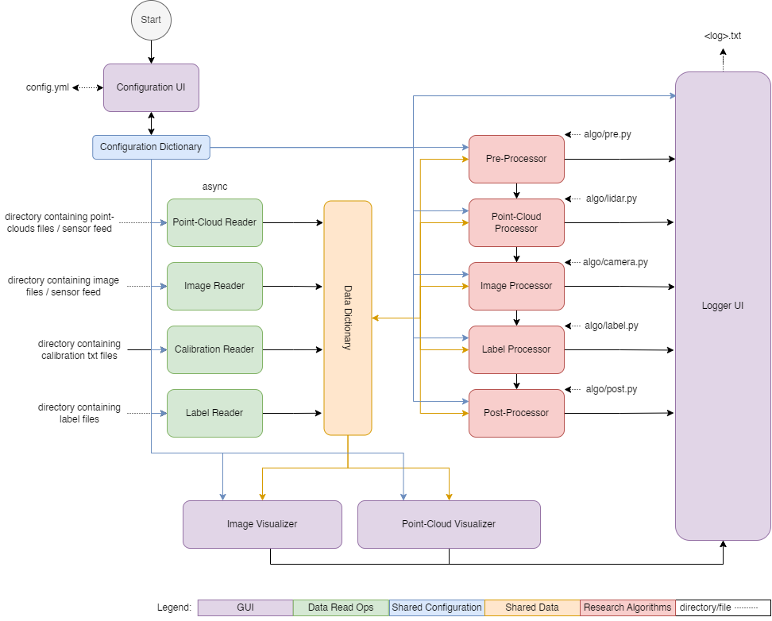

# LiGuard's Architecture and Data Flow

The `LiGuard` architecture consists of five main components: (1) GUI (purple), (2) Data Handlers (green), (3) Shared Configuration Dictionary (blue), (4) Shared Data Dictionary (orange), and (5) Research Algorithms. The GUI component(s) is responsible for creating a user-friendly interface for researchers to interact with the framework and for visualizations of both LiDAR and image data. The Data Handlers component is responsible for reading data from disk/sensor(s). The Shared Configuration Dictionary and Shared Data Dictionary components are responsible for sharing configuration and data between different components of the framework. The Research Algorithms component is responsible for implementing the algorithms that process the data.

Note: The research algorithms are called processing functions in the codebase. The processing functions are defined in the `algo` directory and are decoupled from the GUI and data handlers. The processing functions can be easily added/removed from the processing.