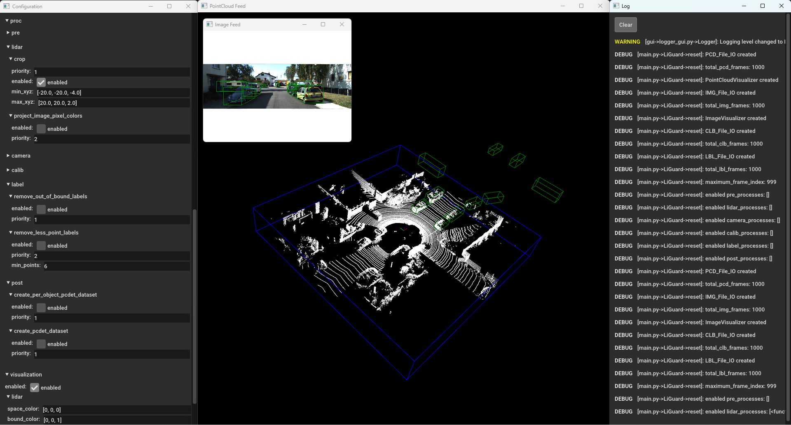

LiGuard
=======

``LiGuard`` is a research-purposed, GUI-powered, Python-based framework
that allows easy development of dynamic point-cloud (and accompanying
image) data processing pipelines by decoupling processes algorithms from
framework’s source code. Please see `Usage <#usage>`__ section below for
more information.

Installation
============

``LiGuard`` is tested on Windows 11 with Python 3.10.0. However, it
should work on any OS that support following dependencies:

::

   keyboard==0.13.5
   pyyaml==6.0.1
   open3d==0.18.0
   opencv-python==4.9.0.80
   dbscan==0.0.12

We recommend using a virtual environment (like Conda) to install the
``LiGuard``.

First create a new virtual environment and activate it:

::

   conda create -n liguard python=3.10
   conda activate liguard

Then, clone the repository:

::

   git clone https://github.com/m-shahbaz-kharal/LiGuard-JOSS.git
   cd LiGuard-JOSS

Lastly, install the dependencies:

::

   pip install -r requirements.txt

Usage
=====

``LiGuard`` is designed to help researchers build dynamic point-cloud
processing pipelines. It act as an execution engine for I/O, processing,
and visualization of both point-cloud and image data. A high-level
architecture diagram is given `here <docs/extra/architecture.md>`__.
Let’s see how to use ``LiGuard`` with a simple yet intuitive example.

An Example Pipeline
-------------------

In this example, we will implement a simple pipeline to read (a subset
of) KITTI dataset, crop the point-clouds, remove any labels that are out
of the crop-bound, also remove labels that have less than 1000 points,
and save the processed dataset in OpenPCDet annotation standard. Let’s
break down the pipeline into steps:

::

   # Pipeline
   1. Read: Read KITTI dataset.
   2. Process:
   - Crop: Crop the point-clouds.
   - Filter Operation 1: Remove out-of-bound labels.
   - Filter Operation 2: Remove labels with less than 1000 points (in the 3d bounding-box).
   3. Post-Process:
   - Save: Cropped point-clouds in npy format.
   - Save: Labels in OpenPCDet annotation standard.

Implementing the Pipeline in LiGuard
------------------------------------

In ``LiGuard``, a pipeline is implemented by creating a configuration
YAML (.yml) file. A default template pipeline configuration (.yml) file
``config_template.yml`` is provided in the ``configs`` directory. Please
do not delete or modify this file. Instead, duplicate it and rename to
your pipeline name; for this example, let’s name it
``my_kitti_config.yml``.

Understanding the Pipeline Config File
~~~~~~~~~~~~~~~~~~~~~~~~~~~~~~~~~~~~~~

This is how it looks:

::

   # This is a LiGuard pipeline configuration file.

   data: # dataset configurations
       path: 'data' # root directory containing dataset
       lidar_subdir: 'lidar' # subdirectory containing point clouds
       camera_subdir: 'camera' # subdirectory containing images
       label_subdir: 'label' # subdirectory containing labels
       calib_subdir: 'calib' # subdirectory containing calibration files
       size: 10 # number of frames to annotate

       lidar:
           enabled: True # set True to read point clouds from disk
           pcd_type: '.bin' # can be .bin or .npy
       camera:
           enabled: False # set True to read images from disk
           img_type: '.png' # most image types are supported
       calib:
           enabled: True # set True to read calibration files from disk
           clb_type: 'kitti' # can be kitti or sustechpoints
       label:
           enabled: False # set True to read labels from disk
           lbl_type: 'kitti' # can be kitti, openpcdet, or sustechpoints

   sensors: # lidar and camera configurations
       lidar: # lidar sensor configurations, at this point only Ouster lidars are supported, support for other lidars is coming soon
           enabled: False # set True to stream point clouds from sensor, please set False if reading from disk
           hostname: '192.168.1.2' # sensor ip address or hostname
           manufacturer: 'Ouster' # sensor manufacturer
           model: 'OS1-64' # sensor model
           serial_number: '000000000000' # sensor serial number
       camera: # camera sensor configurations, at this point only Flir cameras are supported, support for other cameras is coming soon
           enabled: False # set True to stream point clouds from sensor, please set False if reading from disk
           hostname: '192.168.1.3' # sensor ip address or hostname
           manufacturer: 'Flir' # sensor manufacturer
           model: 'BFS-PGE-16S2C-CS' # sensor model
           serial_number: '00000000' # sensor serial number
           camera_matrix: [2552.449042506032, 0.0, 766.5504021841039, 0.0, 2554.320087252825, 553.0299764355634, 0.0, 0.0, 1.0] # camera matrix (K)
           distortion_coeffs: [-0.368698, 0.042837, -0.002189, -0.000758, 0.000000] # distortion coefficients (D)
           T_lidar_camera: [[-0.00315, 0.00319, 0.99999, -0.17392], [-0.99985, -0.01715, -0.00309, 0.00474], [0.01714, -0.99985, 0.00324, -0.05174], [0.00000, 0.00000, 0.00000, 1.00000]] # 4x4 transformation matrix from camera to lidar

   proc: # liguard processing configurations
       pre:
           dummy: # dummy pre-process
               enabled: False # set True to enable
               priority: 1 # priority of process - lower is higher
       lidar:
           crop:
               priority: 1 # priority of process - lower is higher
               enabled: False # set True to crop point cloud
               min_xyz: [-40.0, -40.0, -4.0] # minimum x, y, z
               max_xyz: [+40.0, +40.0, +2.0] # maximum x, y, z
           project_image_pixel_colors:
               enabled: False # set True to paint point cloud with rgb
               priority: 2 # priority of process - lower is higher
       camera:
           project_point_cloud_points: # project point cloud points to camera image
               enabled: False # set True to project point cloud points to camera image
               priority: 1 # priority of process - lower is higher
       calib:
           dummy: # dummy calibration process
               enabled: False # set True to enable
               priority: 1 # priority of process - lower is higher
       label:
           remove_out_of_bound_labels: # crop out of bound bboxes
               enabled: False # set True to crop labels
               priority: 1 # priority of process - lower is higher
       post:
           create_per_object_pcdet_dataset: # create per object dataset in pcdet format
               enabled: False # set True to enable
               priority: 1 # priority of process - lower is higher
           create_pcdet_dataset: # create dataset in pcdet format
               enabled: False # set True to enable
               priority: 1 # priority of process - lower is higher

   visualization: # visualization parameters
       enabled: True # set True to visualize
       lidar:
           space_color: [0, 0, 0] # color of background space
           bound_color: [0, 0, 1] # point cloud range bound bbox color
           point_size: 2.0 # rendered point size
       camera:
           bbox_line_width: 2 # bbox line width

   logging: # parameters for logger
       level: 0 # log level can be 0 (DEBUG), 1 (INFO), 2 (WARNING), 3 (ERROR), 4 (CRITICAL
       path: 'logs' # path to save logs
           
   threads: # don't change unless debugging
       io_sleep: 0.01 # input/output threads sleep time in seconds
       proc_sleep: 0.01 # processing threads sleep time in seconds
       vis_sleep: 0.01 # visualization threads sleep time in seconds

You can see that the pipeline config file is divided into six main
sections. It is important to understand the structure of the pipeline
config file to build the pipeline. Here is a brief overview of each
section:

::

   data: to configure dataset paths and types.
   sensors: to configure sensor connection paramters in case of streaming data.
   proc: to configure processing steps, it has:
   - pre: for configuring pre-processing tasks
   - lidar: for configuring point-cloud processing
   - camera: for configuring image processing
   - calib: for configuring calibration data processing
   - label: for configuring label/annotation processing
   - and post sections: for configuring post-processing tasks
   visualization: for setting visualization parameters.
   logging: for setting logging level and path.
   threads: responsible for changing threading paramters. # don't change unless debugging

Please note that you must not delete the main sections (all the section
names given above are main sections); so if you were to assign levels
based on indenting, upto level 2 sections must be kept same (unless you
are contributing to the repo and think to add a feature to framework
itself). However, you can add new sections (at level 3 or more), so for
example, you can add a new section under ``proc/lidar/`` but not under
``proc``.

Implementing the Pipeline Steps
~~~~~~~~~~~~~~~~~~~~~~~~~~~~~~~

Let’s now modify ``my_kitti_config.yml`` to implement the pipeline we
devised above. ``LiGuard`` has many built-in utility
processes/functions; a list of those is provided in `Utility
Functions <docs/extra/utility_functions.md>`__ that can be used to build
the pipeline. We’ll be using some of these utility functions in our
example.

Pipeline Step # 1: ``LiGuard`` provides built-in capability to read many
standard datasets including KITTI, OpenPCDet, and SUSTechPoints (support
for more public datasets is coming soon). Nothing needs to be done for
this step, as it is already configured in the template pipeline config
file.

Pipeline Step # 2: - Crop: a built-in utility process ``crop`` under
``algo/lidar.py`` can be used to crop the point-clouds. - Filter
Operation 1: a utility process ``remove_out_of_bound_labels`` under
``algo/label.py`` can be used.

Adding a New Process in the Pipeline
~~~~~~~~~~~~~~~~~~~~~~~~~~~~~~~~~~~~

However, as you can see in the pipeline config file, there is no
built-in utility processes for Filter Operation 2 in our pipeline. This
provides an opportunity to demonstrate how to add a novel process in the
pipeline. Please follow the steps below to add a new process in the
pipeline: - add following lines under ``proc/label/`` section in
``my_kitti_config.yml``:

::

   remove_less_point_labels: # remove labels with less than min_points points
       enabled: False # set True to remove labels
       priority: 2 # priority of process - lower is higher
       min_points: 1000 # minimum number of point-cloud points that must be inside the 3d bounding-box label to be consider a label valid otherwise it will be removed

Every process function in the pipeline config file must follow the
following standard format:

::

   # config.yml
   ...
   proc:
       category: # category can be pre, lidar, camera, calib, label, or post
           process_name: # must be at level 3
               enabled: boolean
               priority: integer
               # add more parameters as per your requirement
   ...

| It must have the following parameters:
| - ``enabled``: a boolean to enable/disable the process. -
  ``priority``: an integer to set the priority of the process in the
  category, for example, in the ``label`` category, the
  ``remove_out_of_bound_labels`` process has a priority of 1, so we set
  the ``remove_less_point_labels`` priority to 2; this means that the
  ``remove_out_of_bound_labels`` process will be executed before the
  ``remove_less_point_labels`` process.

You can also add more parameters as per your requirement. For example in
this case, we added ``min_points`` (to make this a tunable paramter in
the GUI later) to set the minimum number of points that must be inside
the 3d bounding-box label to be consider a label valid otherwise it will
be removed. - add the following function in ``algo/label.py``:

::

   def remove_less_point_labels(data_dict: dict, cfg_dict: dict):
       # Get logger object from data_dict
       if 'logger' in data_dict: logger:Logger = data_dict['logger']
       else: print('[CRITICAL ERROR]: No logger object in data_dict. It is abnormal behavior as logger object is created by default. Please check if some script is removing the logger key in data_dict.'); return

       # Check if required data is present in data_dict
       if "current_label_list" not in data_dict:
           logger.log('[algo->label.py->remove_less_point_labels]: current_label_list not found in data_dict', Logger.ERROR)
           return
       if 'current_point_cloud_numpy' not in data_dict:
           logger.log('[algo->label.py->remove_less_point_labels]: current_point_cloud_numpy not found in data_dict', Logger.ERROR)
           return

       # Get label list and point cloud
       lbl_list = data_dict['current_label_list']
       point_cloud = data_dict['current_point_cloud_numpy']
       
       output = []

       for lbl_dict in lbl_list:
           if 'lidar_bbox' not in lbl_dict: continue
           # Get bounding box center, extent, and euler angles
           bbox_center = lbl_dict['lidar_bbox']['lidar_xyz_center']
           bbox_extent = lbl_dict['lidar_bbox']['lidar_xyz_extent']
           bbox_euler_angles = lbl_dict['lidar_bbox']['lidar_xyz_euler_angles']
           R = o3d.geometry.OrientedBoundingBox.get_rotation_matrix_from_xyz(bbox_euler_angles)
           # Create an oriented bounding box
           try: rotated_bbox = o3d.geometry.OrientedBoundingBox(bbox_center, R, bbox_extent)
           except:
               logger.log(f'[algo->label.py->remove_less_point_labels]: failed to create an OrientedBoundingBox, skipping ...', Logger.WARNING)
               continue
           # Get the indices of points within the bounding box
           inside_points = rotated_bbox.get_point_indices_within_bounding_box(o3d.utility.Vector3dVector(point_cloud[:, 0:3]))
           # If the number of points within the bounding box is greater than the specified threshold, add the label to the output list
           if len(inside_points) >= cfg_dict['proc']['label']['remove_less_point_labels']['min_points']: output.append(lbl_dict)

       # Update the label list in data_dict
       data_dict['current_label_list'] = output

Remember that function name must match the name given in the pipeline
config file otherwise it will not be executed.

Let’s take a look into the function. The function
``remove_less_point_labels`` takes two arguments: ``data_dict`` and
``cfg_dict`` that are automatically passed to it by framework as it
called (if ``enabled``) in order of its ``priority``. This is a standard
that ``LiGuard`` follows, so to create any process for your pipeline
your function must have the following signature:

::

   # it must be written in algo/<category>.py file where <category> can be pre, lidar, camera, calib, label, or post
   your_function_name(data_dict: dict, cfg_dict: dict)):
       ... # your function logic

Understanding Parameter Passing in LiGuard
^^^^^^^^^^^^^^^^^^^^^^^^^^^^^^^^^^^^^^^^^^

Let’s talk a little bit more about the ``data_dict`` and ``cfg_dict`` as
these are automatically passed (by reference) to all processes in the
pipeline. The ``data_dict`` is a dictionary that, as the name suggests,
contains the data that is shared between different processes in the
pipeline. The ``data_dict`` contains the following keys: - ``logger``: a
logger object that can be used to log messages. -
``current_frame_index``: an integer representing the current frame
index. - ``maxium_frame_index``: an integer representing the maximum
frame index. and may contain follwoing keys depending on the pipeline. -
``current_point_cloud_numpy``: a numpy array containing the current
point cloud. - ``current_image_numpy``: a numpy array containing the
current image. - ``current_calib_data``: a dictionary containing the
current calibration data in KITTI calibration format, however this may
change based on unavailbility of all matrices. It may contain following
keys: - ``P2``: a 3x4 projection matrix. - ``R0_rect``: a 3x3
rectification matrix. - ``Tr_velo_to_cam``: a 4x4 transformation matrix
from lidar to camera. - ``current_label_list``: a list of dictionaries
containing the current labels. Each dictionary item in the list may
contain the following keys: - ``label_class``: a string representing the
label class. - ``lidar_bbox``: a dictionary containing the lidar
bounding box. It may contain the following keys: - ``lidar_xyz_center``:
a list containing the x, y, z center of the bounding box. -
``lidar_xyz_extent``: a list containing the x, y, z extent of the
bounding box. - ``lidar_xyz_euler_angles``: a list containing the x, y,
z euler angles of the bounding box. - ``camera_bbox``: a dictionary
containing the camera bounding box. It may contain the following keys: -
``camera_uv_center``: a list containing the u, v center of the bounding
box. - ``camera_uv_extent``: a list containing the u, v extent of the
bounding box. - ``camera_uv_euler_angles``: a list containing the u, v
euler angles of the bounding box.

Please note that the above mentioned keys are standard keys that are
used accross the framework. However, you can add more keys to the
``data_dict`` as per your requirement to be shared between different
components of the framework.

The ``cfg_dict`` mirros your pipeline config file, so you can access any
parameter from the pipeline config file using this dictionary. Each
level in the pipeline config file translates to a sub-dictionary in
``cfg_dict``.

Now let’s look into this function’s logic: - The function first checks
if the required data is present in the ``data_dict``. If not, it logs an
error message and returns. It is always a good practice to check if the
required data is present in the ``data_dict`` before using it. - The
function then gets the label list and the point cloud from the
``data_dict`` and for each label: - It creates an oriented bounding box
using the label’s center, extent, and euler angles, checks if the number
of points within the bounding box is greater than the specified
threshold, and if so, adds the label to the output list. - Finally, it
changes the ``current_label_list`` in the ``data_dict``, it is important
to create/update the data in the ``data_dict`` so that it can be shared
across different processes in the pipeline.

Pipeline Step # 3: ``LiGuard`` provides built-in capability to save the
processed lidar data in npy format and labels in OpenPCDet annotation
standard. It is already configured in the pipeline config file, so you
don’t need to do anything.

Running the Pipeline
~~~~~~~~~~~~~~~~~~~~

Now let’s run the pipeline, run the following command to start the
``LiGuard``:

::

   python main.py

This will start the ``LiGuard`` and you’ll see the following two
windows:

==================== ==========
Configuration Window Log Window
==================== ==========
|image1|             |image2|
==================== ==========

*On the left is the Configuration Window, it lets you open, save, and
apply configurations. On the right is the ``Log`` window, it shows the
logs that are generated during the pipeline execution by both the
built-in functions and the user-defined functions (if user-defined
functions are using the logger object).*

Opening the Pipeline Config File
~~~~~~~~~~~~~~~~~~~~~~~~~~~~~~~~

Please go ahead and click open, then select the ``my_kitti_config.yml``
file and click open. This will load the pipeline config file into the
``LiGuard``. You can change the configuration parameters, in this
example case, enable all the data reading processes ``lidar``,
``camera``, ``calib``, and ``label`` and disable all the processes under
``proc``, click apply to apply the changes. You’ll see the data being
read from the disk and displayed in the visualization window. |LiGuard
in Action - Data Reading| *LiGuard’s Layout: from left to right:
Configuration Window, Visualization Window, and Log Window.* #####
Navigation You can navigate through the frames using the ``left arrow``
and ``right arrow`` keys, or press the ``space bar`` to play the frames
in sequence.

Processing the Data
~~~~~~~~~~~~~~~~~~~

Please pause the frames by pressing the space bar again and then enable
the ’\ ``crop`` process under ``proc/lidar`` and click apply. You’ll see
the point-clouds being cropped. |LiGuard in Action - Cropping| *LiGuard
in Action - Cropping Point-Cloud(s)*

Similarly, enable the ``remove_out_of_bound_labels`` and see the
results. |LiGuard in Action - Cropping + Filtering Out Out-of-Bound
Annotation| *Liguard in Action - Cropping + Filtering Out Out-of-Bound
Annotation*

Moving on, please enable, ``remove_less_point_labels`` and see the
results. |LiGuard in Action - Cropping + Filtering Out Annotations With
< 1000 Points| *Liguard in Action - Cropping + Filtering Out Out
Out-of-Bound and Annotations With < 1000 Points*

Finally, if the pipeline is working as expected (check it by manually
navigating a few frames), you can save the pipeline config file by
clicking the ``save`` button. To process the entire dataset, you can
change the ``size`` parameter under the ``data`` section in the pipeline
config file to the number of frames you want to bulk process, disable
the ``visualization``, enable the ``create_pcdet_dataset`` under
``proc/post`` and click apply. Press the space bar to start the
processing. The ``Log`` window will show the progress of the processing.
The processed data is stored under in ``output`` directory under the
root directory of the dataset.

Verifying the Processed Data
~~~~~~~~~~~~~~~~~~~~~~~~~~~~

You can verify the processed data by creating a new pipeline config file
and loading the processed data. For our example, please duplicate the
``config_template.yml``, rename it, and start ``LiGuard``. In the
``data`` section of configuration set the path and sub-paths, make sure
you disable ``camera`` and ``calib`` reading process under ``data`` and
only enable ``lidar`` and ``label``. This is because the ``output``
directory created by ``create_pcdet_dataset`` only contains
``point_cloud`` and ``label`` sub-directories. Also, make sure to set
``lbl_type`` under ``data/label`` to ``openpcdet`` and ``pcd_type``
under ``data/lidar`` to ``.npy``, click apply. You can now visualize the
processed data.

Contributing
============

We welcome contributions to the ``LiGuard`` framework. Please follow the
guidelines below to contribute to the framework: - Fork the repository.
- Create a new branch for your feature or bug fix. - Make your changes.
- Write tests for your changes. - Run the tests. - Create a pull
request.

License
=======

MIT License Copyright (c) 2024 Muhammad Shahbaz - see the
`LICENSE <LICENSE>`__ file for details.

References
==========

-  `Open3D <http://www.open3d.org/>`__
-  `OpenCV <https://opencv.org/>`__
-  `KITTI <http://www.cvlibs.net/datasets/kitti/>`__
-  `OpenPCDet <https://github.com/open-mmlab/OpenPCDet>`__
-  `SUSTechPoints <https://github.com/naurril/SUSTechPOINTS>`__
